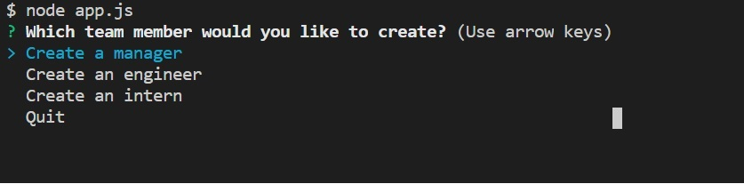
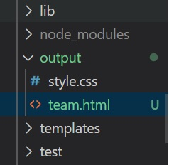
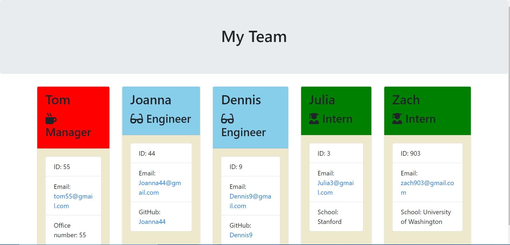

# Team-Profile-Generator

  ## Description
  Allows user to input each member of their team along with their role (manager, engineer, intern) and creating webpage displaying each team member and their info so that the user may have clean, easy access to all of their team members' information.
  
  ## Table of Contents
  [Installation](#installation)
  [Usage](usage)
  [Tests](tests)
  [Contact Creator](contact-creator)
 
  ### Installation
  Inquirer, node
  
  ### Usage
  Download necessary installations and run in console or other form of terminal. You should then be asked which kind of team member you want to create. You have the choice of creating a manager, engineer, intern, or selecting "quit." Like this:
  
  

  No matter which role you choose (except quit), you will be asked for the employee's name, id number, and email. Each role will also come with an additional question specific to that role. Selecting manager will ask for their office number, engineer will ask for engineer's github username, and intern will ask for intern's school. After answering these four questions, you will be asked the original question of which role you would like to add to your team (the questions in the above picture). Create as many team members as you like and once you are done select the "quit" option when prompted again by the original question. YOU MUST SELECT QUIT IN ORDER TO HAVE THE APPLICATION CREATE YOUR WEBPAGE! Once you have quit the program, open the "output" folder to find your new webpage created under the name "team.html". 
  
   
  
  Open this html in your browser to view your new webpage!

You should get something like this:

 
  
  ### Tests
  [Results](./output/test.html)

  #### GitHub Username
  [See GitHub](https://github.com/maxhanson07)

  #### Email Address
  mthanson2@gmail.com

  #### How to reach me
  Shoot me an email.